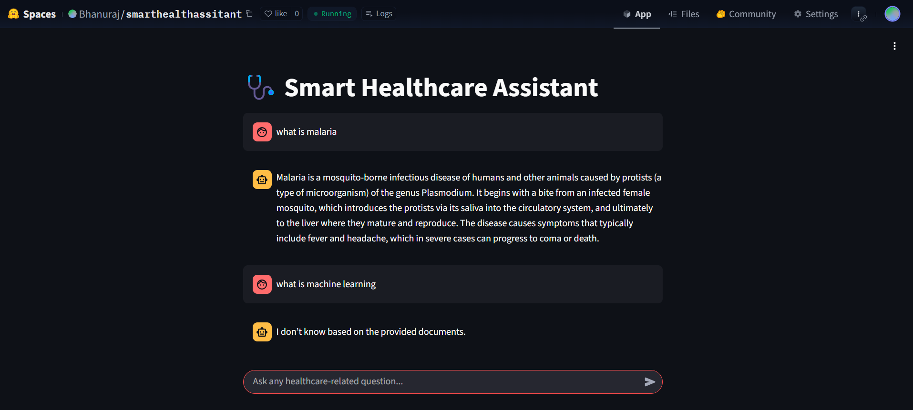

# **Smart Healthcare Assistant**

## Overview
The **Smart Healthcare Assistant** is an AI-powered application that simplifies access to medical and healthcare knowledge by enabling users to query multiple documents simultaneously. Built with **Streamlit** and **Python**, and powered by **Retrieval-Augmented Generation (RAG)**, it provides accurate, context-aware responses from healthcare PDFs and documents.

## Deployment Link

🔗 **Live Demo on HuggingFace Spaces:** [Bhanuraj HuggingFace Space](https://bhanuraj-healthcareassistant.hf.space)

## 🚀 Features

-  **Multi-document QA**: Ask questions across several healthcare PDFs.
-  **RAG-based Answering**: Combines retrieval and generation for factual responses.
-  **Streamlit Interface**: Clean and interactive frontend.
-  **Semantic Search**: Efficient embedding-based document retrieval.
-  **PDF Support**: Ingests and indexes uploaded healthcare documents.
-  **Containerized Deployment**: Runs easily with Docker or on Hugging Face Spaces.
---

### **🔗 Contributors**  
👤 **Bhanuraj**  
📧 **badalbhanuraj@gmail.com**  

📌 **GitHub Repo**: [GitHub](https://github.com/Bhanuraj23m0316iitb/Smart-Health-care-assistant)  

---
